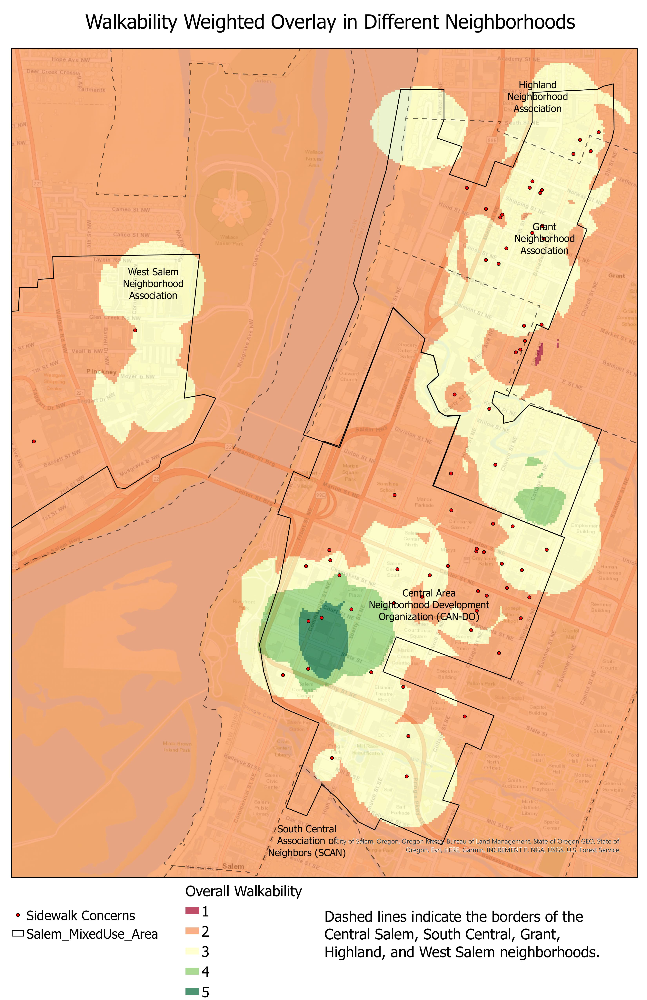

# My Projects

- Project 1: Geospatial Analysis of Walkability in Salem, Oregon

This project utilized large spatial datasets of different walkability factors in Salem, and involved data cleaning, joining, and analysis using ArcGIS Pro to create a deliverable map of city planning recommendations.

[Back to Home](index.md)
